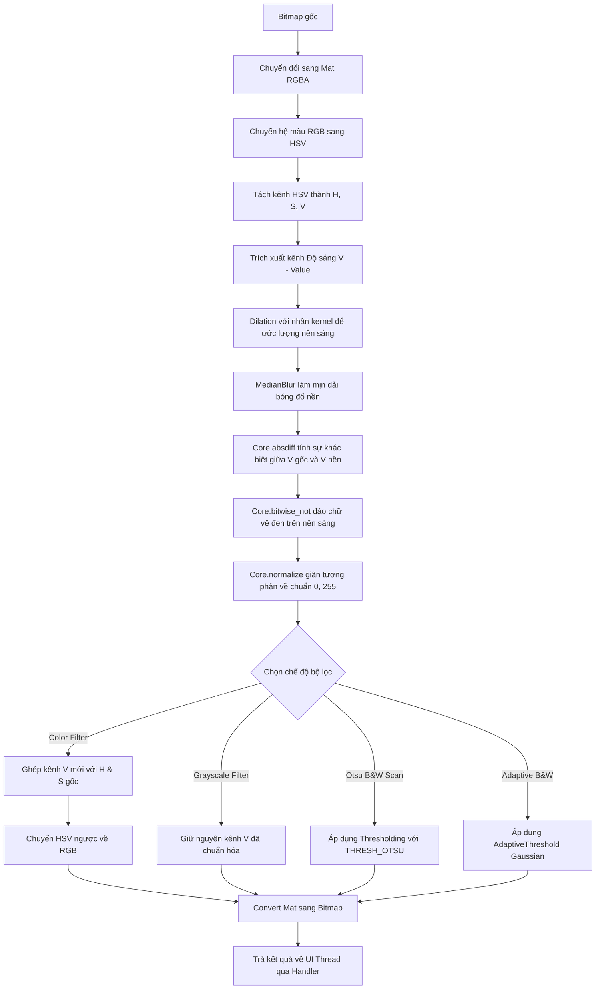

# 📱 OpenCV Document Filter App (Mobile Lab 6)

[](https://kotlinlang.org)
[](https://opencv.org)
[](https://m3.material.io)

Một ứng dụng Android hiện đại được phát triển bằng ngôn ngữ **Kotlin** và thư viện **OpenCV SDK 4.9.0** nhằm loại bỏ bóng đổ (Shadow Removal) trên tài liệu và tự động bẻ cong độ tương phản để tạo ra các bản quét cực kỳ sắc nét. 

Dự án được thiết kế chuẩn **Premium UX/UI** với giao diện **Dark Mode** thời thượng, hiệu ứng bo góc mượt mà, cấu trúc đổ màu HSL bắt mắt và khả năng tương tác nâng cao với các thanh trượt thông số thời gian thực.

---

## 📸 Giao diện ứng dụng & Tính năng nổi bật

### 1. Đa dạng hóa Tài liệu mẫu (Smart Sample Generators)
Ứng dụng tích hợp bộ tạo ảnh tài liệu giả lập chất lượng cao với các lớp bóng đổ ngẫu nhiên phức tạp để người dùng thử nghiệm ngay lập tức:
*   **Trang Sách (Book Page):** Giả lập trang sách trắng tiêu chuẩn với bóng đổ dạng dải màu tuyến tính chéo từ camera điện thoại.
*   **Hóa Đơn Nhiệt (Thermal Receipt):** Giả lập hóa đơn khổ dọc màu kem nhạt, văn bản font chữ nhỏ đứt nét và bóng đổ hình tròn (Spotlight) từ đèn bàn.
*   **Ghi Chú Ô Ly (Grid Note):** Giả lập ghi chú viết tay trên nền giấy tập học sinh màu vàng nhạt có các đường kẻ ô ly màu xanh lam, đi kèm bóng đổ chồng chéo phức tạp từ nhiều nguồn sáng.

### 2. Bảng điều khiển nâng cao (Advanced Tuning Controls)
Người dùng có thể tinh chỉnh thuật toán native của OpenCV thông qua các thanh trượt trực quan:
*   **Dilation Kernel Size (1 - 25 px):** Kích thước nhân nở ảnh để ước lượng vùng nền trắng và xóa chữ.
*   **Median Blur Size (3 - 51 px, luôn là số lẻ):** Độ lớn hạt lọc nhiễu trung vị để làm mịn dải bóng đổ nền.
*   **Binarization Block Size (3 - 99 px, luôn là số lẻ):** Kích thước vùng lân cận cho bộ lọc nhị phân thích nghi (chỉ hiện khi chọn chế độ Adaptive B&W).
*   **Constant C Offset (-20.0 đến +20.0):** Hằng số hiệu chỉnh độ sáng nền trừ đi từ giá trị trung bình có trọng số (chỉ hiện khi chọn chế độ Adaptive B&W).

### 3. Trải nghiệm Wow Factors (Visual Excellence)
*   **Chạm & Giữ để So Sánh (Hold to Compare):** Thiết kế nút so sánh (hình con mắt). Chỉ cần chạm và giữ để xem nhanh tài liệu gốc trước khi khử bóng, nhấc tay ra để quay lại kết quả đã lọc.
*   **Chạm trực tiếp vào Ảnh (Tap-to-Compare):** Nhấn trực tiếp lên thẻ ảnh kết quả để chuyển đổi qua lại giữa ảnh gốc và ảnh đã xử lý chỉ với một chạm.
*   **Thông số động cơ OpenCV (Real-time Engine Stats):** Hiển thị trực quan độ phân giải ảnh đầu vào và thời gian xử lý chi tiết (ví dụ: `Execution Time: 34 ms`) để minh chứng cho hiệu năng xử lý bất đồng bộ native.
*   **Hỗ trợ Song ngữ (Bilingual Localization):** Tự động chuyển đổi giao diện tiếng Anh và tiếng Việt dựa trên ngôn ngữ hệ thống của người dùng.

---

## 🛠️ Thuật toán khử bóng đổ chuyên sâu (OpenCV Pipeline)

Thuật toán được triển khai trong tệp `ShadowRemovalFilter.kt` thực hiện chuỗi xử lý native C++ qua luồng nền `SingleThreadExecutor` nhằm giữ UI hoạt động mượt mà:



---

## 📂 Cấu trúc mã nguồn chính
```text
Mobile-Lab-6/
├── app/
│   ├── src/main/
│   │   ├── java/com/example/lab6/
│   │   │   ├── MainActivity.kt        # Khởi tạo OpenCV, quản lý UI/UX và render ảnh mẫu
│   │   │   └── ShadowRemovalFilter.kt # Triển khai các thuật toán xử lý ảnh OpenCV native
│   │   └── res/
│   │       ├── drawable/              # Chứa các vector icons và custom layout drawables
│   │       │   ├── ic_book.xml, ic_receipt.xml, ic_note.xml, ic_settings.xml
│   │       │   ├── glass_card_background.xml, gradient_button_background.xml
│   │       │   └── seekbar_thumb.xml, seekbar_track.xml
│   │       ├── layout/
│   │       │   └── activity_main.xml     # Layout Material 3 Dashboard tối ưu hóa Dark Mode
│   │       ├── values/
│   │       │   ├── colors.xml            # Định nghĩa các gam màu thiết kế chuẩn HSL Premium
│   │       │   ├── strings.xml           # Nhãn hiển thị tiếng Anh mặc định
│   │       │   └── themes.xml            # Khai báo theme Material 3 và cấu hình Seekbar
│   │       └── values-vi/
│   │           └── strings.xml           # Nhãn hiển thị tiếng Việt hóa hoàn toàn
└── README.md
```

---

## 🚀 Hướng dẫn cài đặt & Biên dịch nhanh

### Điều kiện tiên quyết
*   **Android Studio** Jellyfish 2024.1.1 hoặc mới hơn.
*   **Android SDK:** API 26 trở lên (Android 8.0 Oreo+).
*   Kết nối Internet để Gradle tự động đồng bộ thư viện từ Maven Central.

### Các bước thực hiện
1.  **Mở dự án:** Chọn **File -> Open** trong Android Studio và duyệt đến thư mục `Mobile-Lab-6`.
2.  **Đồng bộ Gradle:** Gradle sẽ tự động tải thư viện OpenCV SDK 4.9.0 trực tiếp từ Maven Central.
3.  **Chạy ứng dụng:** Kết nối thiết bị Android thật (đã bật gỡ lỗi USB) hoặc khởi chạy Máy ảo (AVD), sau đó click nút **Run** (biểu tượng tam giác xanh lục) trên thanh công cụ.

---

## 📝 Bản quyền và Đội ngũ phát triển
*   **Giảng viên hướng dẫn:** Trần Vinh Khiêm
*   **Đội ngũ thiết kế tài liệu:** S3T - Smart Software System Team (01/03/2022)
*   **Lập trình viên hoàn thiện UI/UX & Tính năng nâng cao:** Hồ Hoàng Sơn (hoson2k5@gmail.com)
